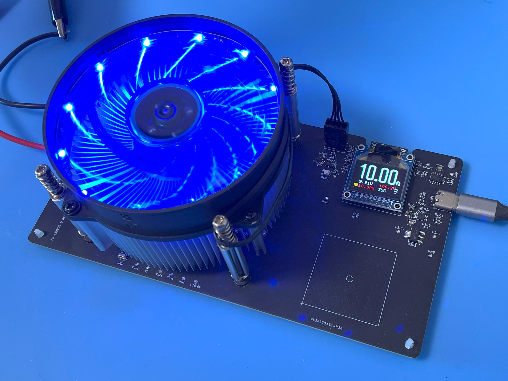
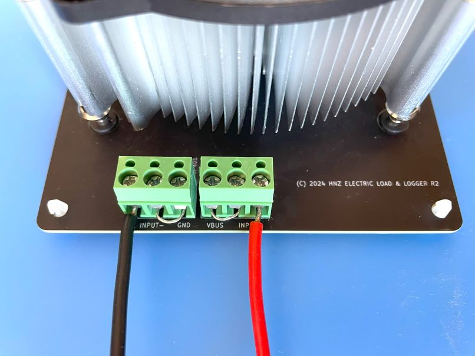
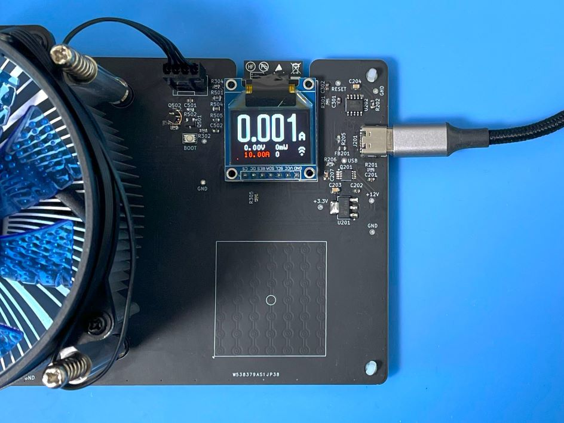
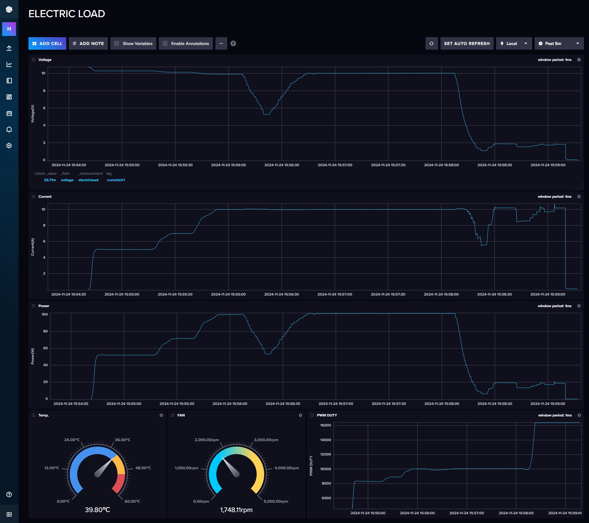

<div align="center">
  <h1><code>Electric Load and Logger</code></h1>
  <p>
    
  </p>
</div>

# Electric Load and Logger

This is an Electric Load and Logger. It can consume the power of the device and send the data to the server.
The maximum power is 100W, maximum voltage is 30V, and maximum current is 10A. But, it must be used under 100W.
And it can measure the voltage, current, and power consumption of the device and send the data to the InfluxDB server. You can see the data on the Dashboard.

# Feature

**High Power** - It can measure the power consumption of the device up to 100W.

**Controllable** - You can control the current consumption by the device. The current can be controlled every 10mA from 10mA to 10A.

**Auto Control** - The current consumption can be controlled automatically by the device using the PID controller.

**High-resolution** - By using Texas Instruments INA228 IC - 20-bit delta-sigma ADC, It can be got measurement data with 195.uV Bus voltage and 163.84mV Shunt voltage. 

**Microcontroller on board** - No need for a client PC when you are measuring. Directly send to the server. 

**Transfer measurement data via WiFi** - This Logger can transfer data to Linux PC via WiFi network and you can see the dashboard graph in influxDB.

**Internal Memory Buffer** - If the WiFi connection is not established, the data is stored in the internal memory buffer. When the WiFi connection is established, the data is sent to the server.

# How to use the Electric Load and Logger

At first, connect the power supply to this electric load as shown in the image below. The Plus line is connected to the 'Input +' terminal, and the GND line is connected to the 'Input -' terminal. And Input- is connected to the GND terminal, and Input+ is connected to the 'VBUS' terminal. This allows the device to measure the voltage.


Then, connect the USB Power Delivery (PD) line to the USB-C port. The PD line must be connected to the USB PD Charger. This load gets power from the USB PD 12V.

After connecting the power supply, the display will show the current voltage, current, and power consumption. Then, you can set the current consumption by the device using the touch pad. Clockwise rotation increases the current, and counterclockwise rotation decreases the current. The current can be controlled every 10mA from 10mA to 10A. Fast rotation will increase or decrease the current quickly every 100mA. After setting the current, press the Center Position of the touch pad during over a second to start the load and measurement. The current consumption can be controlled automatically by the device using the PID controller.



The display shows the current, voltage, power consumption, target current, temperature, PWM duty and status of the load. 
If you start the load, the display shows the yellow color circle in the left bottom corner and blinking. If the load is stopped, the circle disappears.
After the measure, the data is sent to the server. If the WiFi connection is not established, the data is stored in the internal memory buffer. When the WiFi connection is established, the data is sent to the server. However, the memory buffer is not stored more than 4096 samples. If the some data is stored in the memory buffer, the display shows the red bar in the bottom of the display. 

You can see the realtime data using Dashboard by [InfluxDB](https://www.influxdata.com/influxdb/).



After the measure, to stop logging, press the Center Position of the touch pad during over a second. The load is stopped and the data is not sent to the server.

The dashboard shows the graphs of voltage, current, power consumption, and PWM duty. The temperature of the heat sink and FAN RPM also shown in the dashboard. 

# How to build from code and Install to the unit.

Using Ubuntu 22.04.3 LTS and ESP-IDF V5.2.1

## Prerequisites
Ensure that your system meets the following requirements before proceeding with the installation:
- Operating System: Linux-based distribution
- Required Packages: git, python3, python3-pip, gcc, build-essential, curl, pkg-config, libudev-dev, libtinfo5, clang, libclang-dev, llvm-dev, udev, libssl-dev, python3.10-venv

## Installation Steps

### 1. System Update and Package Installation
Update your system and install the necessary packages using:
```bash
sudo apt update && sudo apt -y install git python3 python3-pip gcc build-essential curl pkg-config libudev-dev libtinfo5 clang libclang-dev llvm-dev udev libssl-dev python3.10-venv
```

### 2. Rust Installation
Install Rust programming language and Cargo package manager:
```bash
curl --proto '=https' --tlsv1.2 -sSf https://sh.rustup.rs | sh
```
After installation, activate Rust by sourcing the environment:
```bash
. "$HOME/.cargo/env"
```

### 3. Additional Tools Installation
Install the following Rust tools:
- ldproxy
- espup
- cargo-espflash

Use the following commands:
```bash
cargo install ldproxy
cargo install espup
cargo install cargo-espflash
```
2024-08-12, cargo-espflash can not be compiled.
If you have an error, use the following command.
```bash
cargo install cargo-binstall
cargo binstall cargo-espflash 
```

### 4. ESP Environment Setup
Run the following command to install and update the Espressif Rust ecosystem:
```bash
espup install
espup update
```
Set up environment variables:
```bash
. ./export-esp.sh
```

### 5. Udev Rules Configuration
Configure udev rules for device permissions:
```bash
sudo sh -c 'echo "SUBSYSTEMS==\"usb\", ATTRS{idVendor}==\"303a\", ATTRS{idProduct}==\"1001\", MODE=\"0666\"" > /etc/udev/rules.d/99-esp32.rules'
sudo udevadm control --reload-rules
sudo udevadm trigger
```

### 6. Clone Repository
Clone the TimeLeapCam repository:
```bash
git clone https://github.com/hnz1102/electricload.git
cd electricload/code
```

### 7. Setting WiFi SSID, Password, etc.
Change the following configuration file: `cfg.toml`
You have to set the following parameters. WiFi SSID, Password, InfluxDB Server IP Address, InfluxDB API Key, and InfluxDB API with your ORG.
You can get the API Key from the InfluxDB Web Console. Please see the 'How to Install the influxDB and Configure the Dashboard' section No.3.

```bash
[electricload]
wifi_ssid = "<Your AP SSID>"  # Set your AP SSID
wifi_psk = "<Your AP Password>" # Set your AP Password
http_server = "<InfluxDB Server IP Address:Port>" # Set your InfluxDB Server IP Address and Port ex. 192.168.1.100:8086
pid_kp = "0.001"
pid_ki = "0.022"
pid_kd = "0.00001"
pwm_offset = "4500"
max_current_limit = "15.0"
max_power_limit = "105.0"
influxdb_api_key = "<InfluxDB API KEY>" # Set your InfluxDB API Key
influxdb_api = "/api/v2/write?org=<ORG>&bucket=LOGGER&precision=ns" # Set your InfluxDB API with your ORG and BUCKET ex. /api/v2/write?org=ORG&bucket=LOGGER&precision=ns
influxdb_tag = "currentch1"
influxdb_measurement = "electricload"
```

### 8. Build and Flash
Build the project.
```bash
cargo build --release
```

### 9. Flash the Firmware
Connect the Electric Load and Logger to your PC using a USB cable. Then, flash the firmware:
```bash
cargo espflash flash --release --monitor
```

If your device is not detected, power on the device and during the boot, press the `BOOT` button.
Then, run the flash command again.

### 10. Monitor the Output
After flashing the firmware, the console shows the booting messages.
```bash
[2024-11-24T08:43:44Z INFO ] 🚀 A new version of cargo-espflash is available: v3.2.0
[2024-11-24T08:43:44Z INFO ] Serial port: '/dev/ttyACM0'
[2024-11-24T08:43:44Z INFO ] Connecting...
[2024-11-24T08:43:44Z INFO ] Using flash stub
Finished `release` profile [optimized] target(s) in 0.19s
Chip type:         esp32s3 (revision v0.1)
Crystal frequency: 40 MHz
Flash size:        16MB
Features:          WiFi, BLE
MAC address:       xx:xx:xx:xx:xx:xx
Bootloader:        /esp32/electricload/code/target/xtensa-esp32s3-espidf/release/build/esp-idf-sys-37f4c3bc37bda4bb/out/build/bootloader/bootloader.bin
Partition table:   partitions.csv
App/part. size:    1,358,304/15,728,640 bytes, 8.64%
[2024-11-24T08:43:45Z INFO ] Segment at address '0x0' has not changed, skipping write
[2024-11-24T08:43:45Z INFO ] Segment at address '0x8000' has not changed, skipping write
[2024-11-24T08:43:46Z INFO ] Segment at address '0x10000' has not changed, skipping write
[2024-11-24T08:43:46Z INFO ] Flashing has completed!
Commands:
    CTRL+R    Reset chip
    CTRL+C    Exit

ESP-ROM:esp32s3-20210327
Build:Mar 27 2021
rst:0x15 (USB_UART_CHIP_RESET),boot:0x8 (SPI_FAST_FLASH_BOOT)
Saved PC:0x40378bb6
0x40378bb6 - rtc_isr
    at ??:??
SPIWP:0xee
mode:DIO, clock div:2
load:0x3fce3810,len:0x178c
load:0x403c9700,len:0x4
load:0x403c9704,len:0xcbc
load:0x403cc700,len:0x2d9c
entry 0x403c9914
I (27) boot: ESP-IDF v5.2.2 2nd stage bootloader
I (27) boot: compile time Nov 22 2024 19:30:56
I (27) boot: Multicore bootloader
I (30) boot: chip revision: v0.1
I (34) boot.esp32s3: Boot SPI Speed : 40MHz
I (39) boot.esp32s3: SPI Mode       : DIO
I (44) boot.esp32s3: SPI Flash Size : 16MB
I (49) boot: Enabling RNG early entropy source...
I (54) boot: Partition Table:
I (58) boot: ## Label            Usage          Type ST Offset   Length
I (65) boot:  0 nvs              WiFi data        01 02 00009000 00006000
I (72) boot:  1 phy_init         RF data          01 01 0000f000 00001000
I (80) boot:  2 factory          factory app      00 00 00010000 00f00000
I (87) boot: End of partition table
I (91) esp_image: segment 0: paddr=00010020 vaddr=3c0e0020 size=52034h (335924) map
I (183) esp_image: segment 1: paddr=0006205c vaddr=3fc9ae00 size=04ce8h ( 19688) load
I (189) esp_image: segment 2: paddr=00066d4c vaddr=40374000 size=092cch ( 37580) load
I (200) esp_image: segment 3: paddr=00070020 vaddr=42000020 size=ddea0h (908960) map
I (427) esp_image: segment 4: paddr=0014dec8 vaddr=4037d2cc size=0dae8h ( 56040) load
I (453) boot: Loaded app from partition at offset 0x10000
I (453) boot: Disabling RNG early entropy source...
I (464) cpu_start: Multicore app
I (465) octal_psram: vendor id    : 0x0d (AP)
I (465) octal_psram: dev id       : 0x02 (generation 3)
I (468) octal_psram: density      : 0x03 (64 Mbit)
I (473) octal_psram: good-die     : 0x01 (Pass)
I (478) octal_psram: Latency      : 0x01 (Fixed)
I (484) octal_psram: VCC          : 0x01 (3V)
I (489) octal_psram: SRF          : 0x01 (Fast Refresh)
I (495) octal_psram: BurstType    : 0x01 (Hybrid Wrap)
I (500) octal_psram: BurstLen     : 0x01 (32 Byte)
I (506) octal_psram: Readlatency  : 0x02 (10 cycles@Fixed)
I (512) octal_psram: DriveStrength: 0x00 (1/1)
I (518) MSPI Timing: PSRAM timing tuning index: 4
I (523) esp_psram: Found 8MB PSRAM device
I (527) esp_psram: Speed: 80MHz
I (543) cpu_start: Pro cpu start user code
I (543) cpu_start: cpu freq: 160000000 Hz
I (543) cpu_start: Application information:
I (546) cpu_start: Project name:     libespidf
I (551) cpu_start: App version:      9e8d2c8-dirty
I (557) cpu_start: Compile time:     Nov 22 2024 19:30:46
I (563) cpu_start: ELF file SHA256:  000000000...
I (568) cpu_start: ESP-IDF:          v5.2.2
I (573) cpu_start: Min chip rev:     v0.0
I (578) cpu_start: Max chip rev:     v0.99 
I (582) cpu_start: Chip rev:         v0.1
I (587) heap_init: Initializing. RAM available for dynamic allocation:
I (594) heap_init: At 3FCA4390 len 00045380 (276 KiB): RAM
I (600) heap_init: At 3FCE9710 len 00005724 (21 KiB): RAM
I (607) heap_init: At 3FCF0000 len 00008000 (32 KiB): DRAM
I (613) heap_init: At 600FE010 len 00001FD8 (7 KiB): RTCRAM
I (619) esp_psram: Adding pool of 8192K of PSRAM memory to heap allocator
I (627) spi_flash: detected chip: gd
I (631) spi_flash: flash io: dio
W (635) pcnt(legacy): legacy driver is deprecated, please migrate to `driver/pulse_cnt.h`
W (643) i2c: This driver is an old driver, please migrate your application code to adapt `driver/i2c_master.h`
W (654) timer_group: legacy driver is deprecated, please migrate to `driver/gptimer.h`
W (663) ADC: legacy driver is deprecated, please migrate to `esp_adc/adc_oneshot.h`
I (671) sleep: Configure to isolate all GPIO pins in sleep state
I (678) sleep: Enable automatic switching of GPIO sleep configuration
I (685) main_task: Started on CPU0
I (695) esp_psram: Reserving pool of 32K of internal memory for DMA/internal allocations
I (695) main_task: Calling app_main()
I (715) electricload: [Limit] Current: 15A  Power: 105W
I (715) gpio: GPIO[15]| InputEn: 0| OutputEn: 0| OpenDrain: 0| Pullup: 0| Pulldown: 0| Intr:0 
I (725) gpio: GPIO[16]| InputEn: 0| OutputEn: 0| OpenDrain: 0| Pullup: 0| Pulldown: 0| Intr:0 
I (735) electricload::displayctl: Start Display Thread.
I (735) electricload: INA228 Config: FB6A
I (735) electricload: current_lsb=3.125e-5 shunt_cal_val=2048.0 shunt_cal=2048
I (745) electricload: Max duty: 16383
I (755) electricload: Max duty: 255
I (755) gpio: GPIO[42]| InputEn: 0| OutputEn: 0| OpenDrain: 0| Pullup: 0| Pulldown: 0| Intr:0 
I (765) gpio: GPIO[41]| InputEn: 0| OutputEn: 0| OpenDrain: 0| Pullup: 0| Pulldown: 0| Intr:0 
I (775) electricload::pulscount: Start puls count thread.
I (785) pp: pp rom version: e7ae62f
I (785) net80211: net80211 rom version: e7ae62f
I (805) wifi:wifi driver task: 3fcc2b98, prio:23, stack:6656, core=0
I (805) wifi:wifi firmware version: 3e0076f
I (805) wifi:wifi certification version: v7.0
I (805) wifi:config NVS flash: disabled
I (805) wifi:config nano formating: disabled
I (815) wifi:Init data frame dynamic rx buffer num: 32
I (815) wifi:Init static rx mgmt buffer num: 10
I (825) wifi:Init management short buffer num: 32
I (825) wifi:Init static tx buffer num: 16
I (825) wifi:Init tx cache buffer num: 32
I (835) wifi:Init static tx FG buffer num: 2
I (835) wifi:Init static rx buffer size: 1600
I (845) wifi:Init static rx buffer num: 10
I (845) wifi:Init dynamic rx buffer num: 32
I (845) wifi_init: rx ba win: 6
I (965) wifi_init: tcpip mbox: 32
I (965) wifi_init: udp mbox: 6
I (965) wifi_init: tcp mbox: 6
I (965) wifi_init: tcp tx win: 5760
I (975) wifi_init: tcp rx win: 5760
I (975) wifi_init: tcp mss: 1440
I (985) wifi_init: WiFi IRAM OP enabled
I (985) wifi_init: WiFi RX IRAM OP enabled
I (995) phy_init: phy_version 670,b7bc9b9,Apr 30 2024,10:54:13
I (1035) wifi:mode : sta ()
I (1035) wifi:enable tsf
I (3985) wifi:new:<4,0>, old:<1,0>, ap:<255,255>, sta:<4,0>, prof:1
I (3985) wifi:state: init -> auth (b0)
I (3985) wifi:state: auth -> assoc (0)
I (3995) wifi:state: assoc -> run (10)
I (4005) wifi:connected with xxxxxxxx, aid = 7, channel 4, BW20, bssid = xx:xx:xx:xx:xx:xx
I (4005) wifi:security: WPA2-PSK, phy: bgn, rssi: -36
I (4005) wifi:pm start, type: 1
I (4005) wifi:dp: 1, bi: 102400, li: 3, scale listen interval from 307200 us to 307200 us
I (4015) wifi:set rx beacon pti, rx_bcn_pti: 0, bcn_timeout: 25000, mt_pti: 0, mt_time: 10000
I (4025) wifi:AP's beacon interval = 102400 us, DTIM period = 1
I (4065) electricload::wifi: Wifi connected
I (4065) esp_idf_svc::sntp: Initializing
I (4065) esp_idf_svc::sntp: Initialization complete
I (4065) electricload: NTP Sync Start..
I (7475) electricload: NTP Sync Completed: 2024-11-24 08:43:53
I (7475) electricload::transfer: Start transfer thread.
I (7475) electricload::touchpad: Start TouchPad Read Thread.
I (7485) gpio: GPIO[18]| InputEn: 0| OutputEn: 0| OpenDrain: 0| Pullup: 0| Pulldown: 0| Intr:0 
I (7495) electricload: PID Controller: KP=0.001 KI=0.022 KD=0.00001
I (7585) electricload::touchpad: TouchPad4 threshold: 1529
I (7585) electricload::touchpad: TouchPad5 threshold: 1519
I (7585) electricload::touchpad: TouchPad6 threshold: 1433
I (7585) electricload::touchpad: TouchPad7 threshold: 1523
I (7595) electricload::touchpad: TouchPad8 threshold: 297
I (7605) electricload::touchpad: TouchPad3 threshold: 1436
I (7605) electricload::touchpad: TouchPad9 threshold: 291
I (7625) electricload::touchpad: TouchPad1 threshold: 325
I (7625) electricload::touchpad: TouchPad2 threshold: 1619
I (7625) electricload::touchpad: TouchPad14 threshold: 313
I (7645) electricload::touchpad: TouchPad13 threshold: 307
I (7645) electricload::touchpad: TouchPad12 threshold: 302
I (7645) electricload::touchpad: TouchPad11 threshold: 287
I (7645) electricload::touchpad: TouchPad10 threshold: 281
I (7665) electricload::touchpad: TouchPad charge discharge times: 500 -> 1000
```

## How to Install the influxDB and Configure the Dashboard

### 1. Download [influxDB](https://docs.influxdata.com/influxdb/v2.7/install/?t=Linux) and Install.
```bash
$ wget https://dl.influxdata.com/influxdb/releases/influxdb2-2.7.0-amd64.deb
$ sudo dpkg -i influxdb2-2.7.0-amd64.deb
$ sudo service influxdb start
```

### 2. Configure the influxDB

```
Connect to the 'http://<influxDB installed PC Address>:8086'
```
Click `GET STARTED` and set `Username`, `Password`, `Initial Organization Name`, and `Initial Bucket Name`
|Term|Value|
|---|---|
|Username|Set login username as influxDB administrator web console|
|Password|Set login password as influxDB administrator web console|
|Initial Organization Name| Organization Name ex. ORG|
|Initial Bucket Name| LOGGER |

After set them, click `CONTINUE`.

### 3. Copy the operator API token.

You can see the operator API token on the browser. YOU WON'T BE ABLE TO SEE IT AGAIN!
If you want to get new API token, click `API Tokens` menu form `Sources` Icon, then click `GENERATE API TOKEN` and select `All access token`, click `Save`.
You can see a new API token and get it.
After copy the token, click `CONFIGURE LATER`.

### 4. Import the Dashboard Template.

Click the `Dashboard` icon, and select `Import Dashboard` from the `CREATE DASHBOARD` menu.

Drop the `influxdb/electric_load.json` file to `Drop a file here`, then click `IMPORT JSON AS DASHBOARD`.

You can see the `ELECTRIC LOAD` pannel on the Dashboards page.

Click this panel, and You can see the dashboard.

If you want to customize the dashboard design, click configure mark. You can change the graph design.

## Schematic, PCB Gabar Data

There is a Schematic data in hardware directory. 
If you want to make the PCB, you can order the [PCBway](https://www.pcbway.com/project/shareproject/Digitally_Controlled_Electric_Load_504eb052.html) this link.
The heat sink is not included in the schematic data. You can use the heat sink with the fan for LGA115x CPU Cooler. 

I used this [heat sink](https://www.ainex.jp/products/cc-06b/)

I guess another [heat sink](https://www.tronwire.com/collections/tronwire-cpu-coolers/products/tw-10) is also good.

This PCB is designed by [Kicad](https://www.kicad.org/). This board image photo is shown the jumper wire. But, the PCB data is already fixed the error.

UPDATE 2024-12-29: I changed the OpAmp from TSB6111ILT to OPA187IDBVR. OPA187IDBVR is a low noise and low offset voltage OpAmp. It can be used for the high precision control.

## LICENSE
This source code is licensed under MIT. Other Hardware Schematic documents are licensed under CC-BY-SA V4.0.
